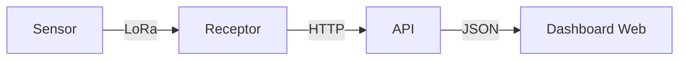

# EcoMonitor – Campeão do Start Farm 2025

> 🏆 **Projeto vencedor da 3ª edição do Start Farm (2025)**
> Protótipo de sistema IoT para monitoramento de emissões atmosféricas em indústrias, unindo **hardware**, **comunicação LoRa** e **dashboard web em React** para visualização de dados em tempo real.

---

## Visão Geral

O **EcoMonitor** nasceu do desafio de monitorar emissões de gases em ambientes industriais de forma acessível, modular e escalável.
Nosso protótipo integra:

* 🛠️ **PCB com sensores de gases** (CO, NO₂, SO₂, PM2.5)
* 📡 **Comunicação LoRa** para transmitir os dados ao receptor
* 🌐 **Gateway receptor** conectado à internet que envia os dados para a API
* 💻 **Dashboard web** desenvolvido em React para exibição em tempo real

---

## Arquitetura do Sistema



1. **Sensor:** Coleta dados dos gases e transmite via rádio LoRa.
2. **Receptor:** Recebe os pacotes LoRa e envia para a API via conexão de internet.
3. **API:** Disponibiliza os dados para o dashboard (mock no protótipo).
4. **Dashboard React:** Exibe métricas, gráficos e relatórios em tempo real.

---

## Hardware

* **PCB personalizada** projetada para integrar sensores e módulo LoRa
* **Microcontrolador:** Compatível com comunicação LoRa (ESP32 + SX1278)
* **Sensores:**
  * CO – Monóxido de Carbono
  * NO₂ – Dióxido de Nitrogênio
  * SO₂ – Dióxido de Enxofre
  * PM2.5 – Material Particulado
* **Comunicação:** LoRa de longo alcance
* **Alimentação:** Bateria

---

## Dashboard Web

A aplicação web foi construída em **React + TypeScript + Tailwind CSS**, oferecendo:

* 📊 **Gráficos interativos** (linha, barra, pizza, área)
* 🌗 **Dark mode** com persistência no localStorage
* 📱 **Design responsivo** (Mobile-First)
* 🧩 **Arquitetura modular** com hooks e componentes reutilizáveis

### Estrutura do Código

```
src/
├── components/          # Componentes reutilizáveis
│   ├── Sidebar.tsx     # Navegação lateral
│   ├── Header.tsx      # Cabeçalho com toggle dark mode
│   ├── Layout.tsx      # Layout principal
│   ├── Chart.tsx       # Componente genérico de gráficos
│   └── Card.tsx        # Cards de métricas
├── hooks/              # Hooks customizados
│   ├── useSidebar.ts   # Controle da sidebar
│   ├── useTheme.ts     # Gerenciamento de tema
│   └── useMockData.ts  # Dados mockados
├── pages/              # Páginas da aplicação
│   ├── Dashboard.tsx   # Página principal
│   ├── Relatorios.tsx  # Gestão de relatórios
│   ├── Sensores.tsx    # Monitoramento de dispositivos
│   └── Configuracoes.tsx # Configurações do sistema
├── data/               # Dados mockados
│   └── mockData.ts     # Dados simulados da API
├── types/              # Definições TypeScript
│   └── index.ts        # Interfaces e tipos
├── lib/                # Utilitários
│   └── utils.ts        # Funções auxiliares
├── App.tsx             # Componente raiz com rotas
├── main.tsx            # Ponto de entrada
└── index.css           # Estilos globais
```

Você pode acessar a prévia do dashboard aqui: [**Clique aqui para abrir**](https://start-farm-2025.vercel.app)

## Equipe

Este projeto foi desenvolvido durante o **Start Farm 2025**, resultando no **1º lugar** da competição.

* [João Pedro](https://github.com/joaopedroleonel)
* [João Gustavo](https://github.com/joaosilva-web)

---

## Nota Importante

Este projeto foi desenvolvido como parte de um **desafio no Start Farm 2025** com o objetivo de **propor e demonstrar uma solução para o problema apresentado**.

Por isso:
* Algumas funcionalidades são **mockadas** ou simuladas.
* O dashboard utiliza **dados fictícios** para visualização.
* Não se trata de uma solução pronta para produção.
